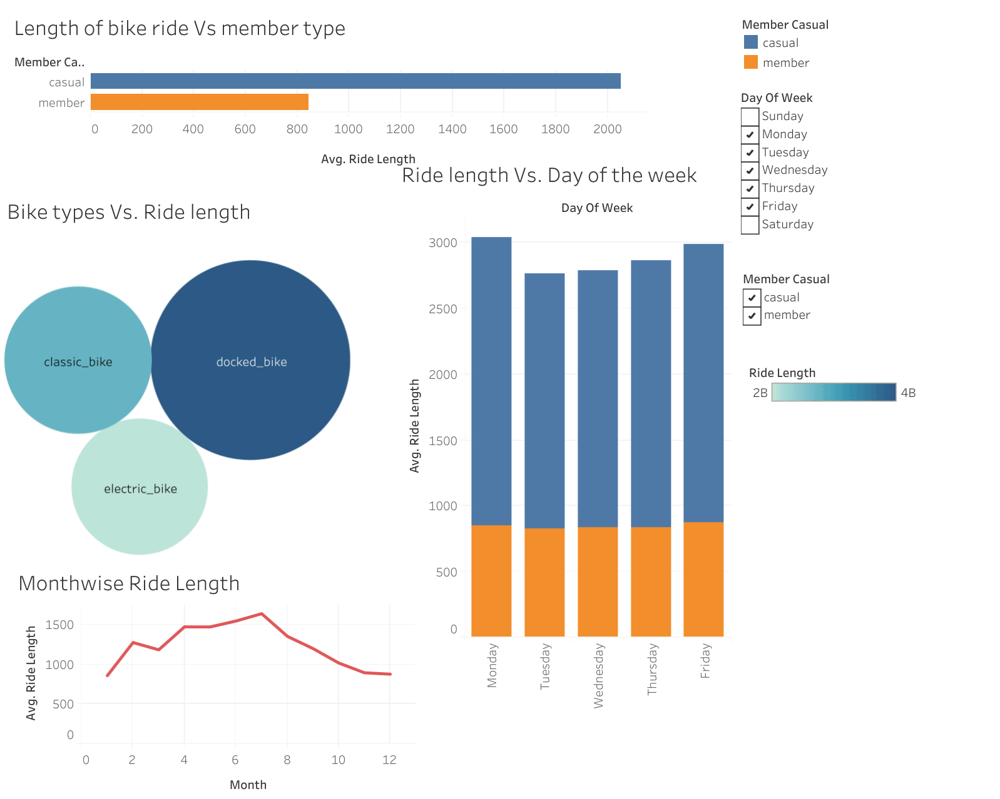

# Objectives
To provide a data analytic view for the bike riding companies and to extract the type of riders, duration of the ride and on the whole ride summary on weekdays and weekends. This analysis is carried out in order to maximize the number of annual memberships. Therefore, it is necessary to understand how casual riders and annual members use Cyclistic bikes differently. From these insights, we try to derive new marketing strategy to improve the bike business with compelling data insights and professional data visualizations.

# Analysis Platform
-R for data cleaning 
-Tableau for visualization

# Data and cleaning via R

The data of the fictious company is obtained from  https://divvy-tripdata.s3.amazonaws.com/index.html and the data used for the analysis can also be obtained from https://drive.google.com/drive/u/1/folders/1LDNkCFj3uQ24ea01ygHnkcqqEgpKWewE. Please contact me if you cannot download the data from the google drive. 

We did the following data cleaning
- After loading the data we extracted the data only for the recent years 2020 and 2021. 
- Using the data time field we computed the ride length (the duration of the ride) and also we extracted the day and month of the year. 
 

# Analytics questions
We ask the following questions before we start to clean the data and begin the analysis
1. How do annual members and casual riders use bikes differently?
2. Are there any difference among the annual memberships in terms of ride length and day of the week?
3. From which stations, the riders utilize the bike more often?

# Findings 

From the data, we observed the following for the years 2020 and 2021

1. The ride length of the causal members is larger than the members, which is surprising.
2. Both causal and members use the bike more on the weekends than  the weekdays. Among the weekdays, Wednesday shows the maximum ride length 
3. There exits a pattern of ride among the riders in terms of month. In fact, during the summers of 2020, 2021 the ride length are at their peak.
4. There exits a preference among the riders the station from where they start and end the ride. This is very useful for recommdation to place more bikes in the most often used stations to improve the business. 

### **Figure. The Tableau Dashboard of the finding from the data **
 
